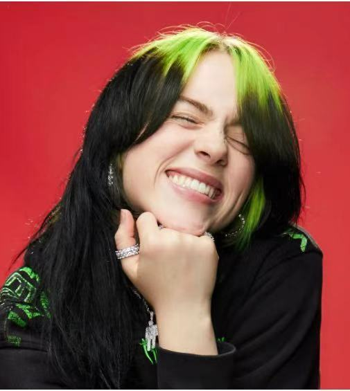
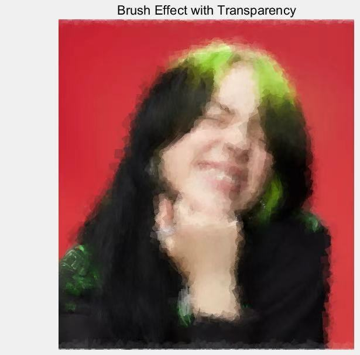
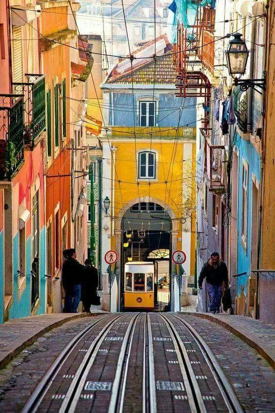
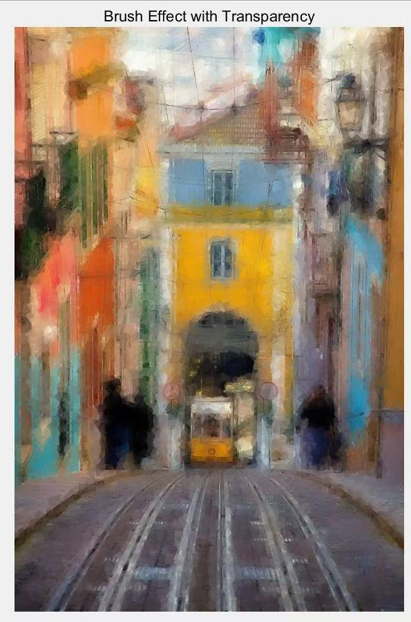
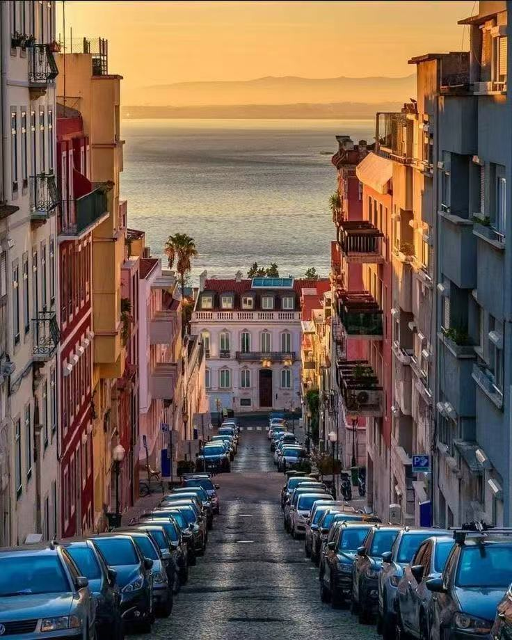
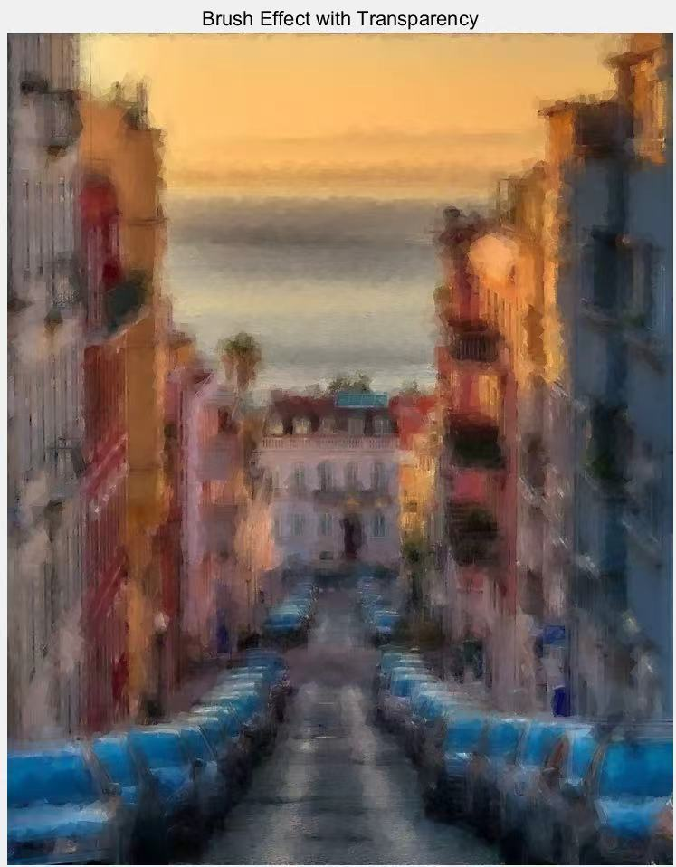

# Artify-photographs
The idea is to turn a photograph of a scene or a person, and process it to create something that looks more like it has been painted as an artwork, and not a photo.

## Outcome

<table>
  <tr>
    <th>Original Image</th>
    <th>After Effect Image</th>
  </tr>
  <tr>
    <td></td>
    <td></td>
  </tr>
  <tr>
    <td></td>
    <td></td>
  </tr>
  <tr>
    <td></td>
    <td></td>
  </tr>
</table>

## Assumptions
- Artistic paintings often exhibit visible brush strokes and reduced fine detail.
- Simple geometric primitives (rectangles and dots) can approximate painterly textures.
- Layering coarse and fine visual elements improves perceived realism.

## Objective
To generate images with a painterly appearance by:
- reducing effective image resolution,
- reconstructing images using brush-like geometric shapes,
- layering shapes of different sizes with controlled transparency.

## Approach

### Rectangle-Based Reconstruction
The image is rebuilt using colored rectangles sampled from the original image.  
This simulates large brush strokes and establishes the overall structure.

### Dot-Based Reconstruction
The image is reconstructed using colored dots, creating a stippled or pointillist effect that enhances texture.

### Combined Layered Method
Rectangles are first used to form a coarse base layer, followed by dots to add finer details.  
The generated layers are blended with the original image using transparency to produce a richer painterly effect.

